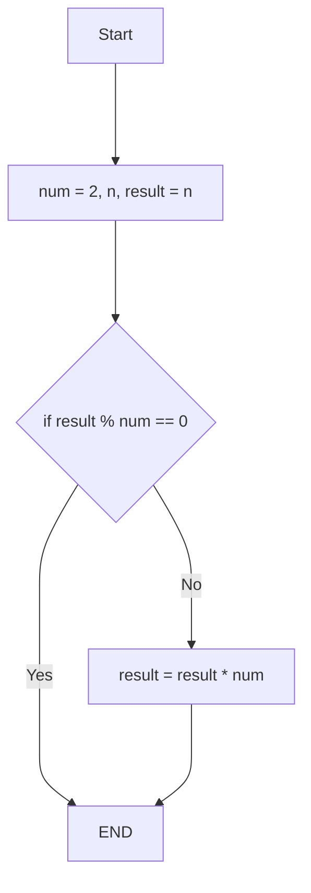

Given a positive integer n, return the smallest positive integer that is a multiple of both 2 and n.
 

<!-- Example 1:

Input: n = 5
Output: 10
Explanation: The smallest multiple of both 5 and 2 is 10.
Example 2:

Input: n = 6
Output: 6
Explanation: The smallest multiple of both 6 and 2 is 6. Note that a number is a multiple of itself. -->
1 <= n <= 150

